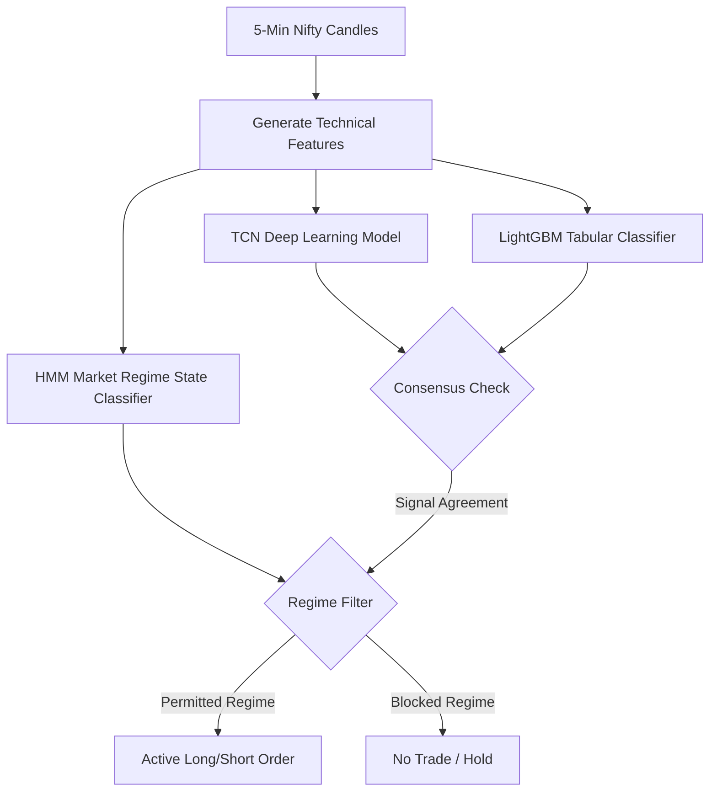

# PASSKEY: rushit2712
# 📈 Nifty Algo Trading Console

An intelligent, multi-model algorithmic trading console and execution engine. It combines Deep Learning (TCN), Machine Learning (LightGBM), and statistical state estimation (HMM) to automate trading decisions on the Nifty Index.

---

## 0. About the Console (Features)

The trading console is designed as a complete end-to-end framework:
* **Interactive Live Charts**: Built using `lightweight-charts.js`, displaying real-time candle data, running technical indicators, and plotting entry/exit execution markers.
* **Auto-Recovery Database Sync**: On boot, the backend automatically detects data gaps since the last entry in `old data.csv` and queries the missing 5-minute candles via the Angel One API to keep the historical database contiguous.
* **5-Minute Trial Mode**: Allows guest users to inspect live feeds and charts instantly using pre-configured fallback developer credentials. It automatically triggers a subscription screen after 5 minutes to release API bandwidth.
* **Encrypted Credential Manager**: Encrypts and decrypts user broker tokens (API key, Client ID, Password, TOTP Secret) locally using AES-256 before saving them to the database.

---

## 1. Problem Statement

Individual traders face severe challenges in live markets:
* **Emotional Trading & Lack of Discipline**: Traders fail to cut losses or exit trends because of panic or greed, leading to account blowouts.
* **Complex Multi-Dimensional Signals**: Checking candlesticks, indicators (RSI, Stochastic, BBands), and market regime status at the same time is too slow when done manually.
* **Sideways Market Whiplashes**: Standard trend-following models perform well in clean trends but suffer severe drawdowns (whiplashes) in range-bound (sideways) markets.

---

## 2. Why It Needed Solving (How It Helps)

This project solves these issues by automating execution:
* **Consensus Gatekeeping**: It replaces human guesswork with an objective rule where trades only enter when deep learning and machine learning models agree, and the statistical regime filter permits the trade.
* **Strict Risk Controls**: Every trade is bound to hard SL (Stop Loss), TP (Take Profit), and dynamic trailing exits.
* **Dynamic Position Sizing**: It features a thermal dissipation sizer. If the system encounters consecutive losses, it automatically shrinks the lot size to preserve capital, increasing it only as the model's win rate stabilizes.

---

## 3. How It Was Implemented (Core Machine Learning Models)

The system relies on a consensus of **three core models** to make trading decisions:



### 1. Temporal Convolutional Networks (TCN) - Deep Learning
* **Role**: Sequential trend prediction.
* **Implementation**: TCN replaces standard RNNs/LSTMs. It uses dilated causal convolutions to process a 500-candle historical window. It captures long-term temporal dependencies in index price movements without gradient dissipation.
* **Output**: Predicts whether Nifty is in an uptrend (BUY) or downtrend (SELL) based on historical chart structure.

### 2. LightGBM Classifier - Machine Learning
* **Role**: Tabular feature classifier.
* **Implementation**: Standard gradient-boosted decision trees trained on processed tabular features (Stochastic %K/%D, CCI-14, Williams %R, SMA/EMA diffs, BBands width, Range-to-ATR ratio, and historical returns).
* **Output**: Predicts the statistical probability of a bullish breakout or bearish breakdown.

### 3. Hidden Markov Models (HMM) - Regime Filtering
* **Role**: Market condition gatekeeper.
* **Implementation**: An unsupervised statistical model that categorizes price action into 8 discrete volatility states (e.g. *compression, expansionup, distributiondown, markup, markdown*).
* **Output**: Acts as a safety filter. If the HMM determines the market is in a compression (choppy/sideways) or counter-trend expansion state, it blocks orders to avoid whiplash.

### 4. Risk-Managed Execution & Trailing Exits
* **Target-Profit (TP) / Stop-Loss (SL)**: Positions exit on a fixed point SL (60 points) or TP (150 points).
* **Thermal Dissipation Sizer**: Lot sizes are dynamically scaled. After losses, it reduces positions to 0.5 lots or less, returning to full size only when win probability recovers.

---

## 4. Languages Used

* **Python**: Backend server (FastAPI), machine learning model execution (TCN, LightGBM, HMM), backtest runner, and database migrations.
* **JavaScript**: Interactive UI charting (`lightweight-charts.js`) and live data streaming over WebSockets.
* **HTML & CSS**: Dashboard styling with a fully responsive grid system, dark theme, and mobile viewport controls.

---

## 5. ML / DL Frameworks Used

* **PyTorch (`torch`)**: Used for compiling, loading, and executing the Temporal Convolutional Network (TCN) deep learning model.
* **`lightgbm`**: Used for loading the gradient-boosted tabular classifier and running real-time inference.
* **`hmmlearn`**: Used for executing the Hidden Markov Model state decoding.
* **`scikit-learn`**: Used for standard tabular feature scaling and model utility functions.
* **`TA-Lib`**: Core technical analysis library used to calculate indicators (RSI, Stochastic, CCI, BBands, ATR).

---

## 6. Outcome (Nifty Spot Backtest: 2024 - 2026)

This represents the actual performance of the **243A Model** (Consensus ML Strategy) simulated over the full dataset from **January 1, 2024 to August 13, 2026** (using your exact position sizing, sizer temperature, and EOD time filters):

> [!IMPORTANT]
> **Nifty Index Points PnL**: The profit/loss (PnL) values shown in the backtests and logs represent **Nifty Index points**, not option premium PnL.

* **Dataset Name**: `nifty_2024_26_warmup.csv` (Nifty 5-Minute Spot candles)
* **Total Signals**: `3,501`
* **Active Trades Taken**: `1,891`
* **Starting Capital**: `100,000.00 INR`
* **Ending Capital**: **`385,840.75 INR`**

### Performance Metrics:
* **Win Rate (Active)**: **`49.71%`** (Baseline: `47.10%`)
* **Avg Lot Size**: `0.68 lots`
* **Total PnL (1 QTY)**: **`22,952.85 Nifty points`**
* **Total PnL (Risk-Managed)**: **`+285,840.75 INR (+285.8% Return)`**
* **Max Drawdown (DD)**: **`110,051.50 INR`**
* **Recovery Factor (RF)**: **`15.81`** (Baseline: `8.48`)

---

## ⚙️ How to Run Locally

1. **Clone the repository**:
   ```bash
   git clone https://github.com/Rushit16102004/algo-trading-console.git
   cd algo-trading-console
   ```
2. **Install Dependencies**:
   ```bash
   pip install -r requirements.txt
   ```
3. **Start the Trading Console**:
   ```bash
   uvicorn backend_engine.web_app:app --host 127.0.0.1 --port 8050
   ```
4. **Open in Browser**: Navigate to [http://127.0.0.1:8050](http://127.0.0.1:8050).
